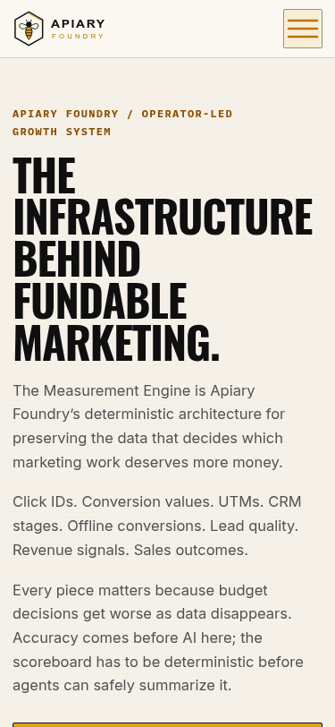
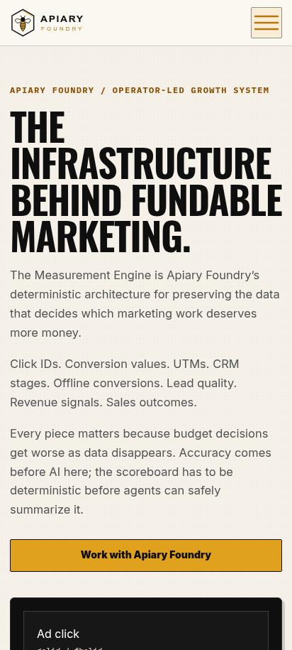
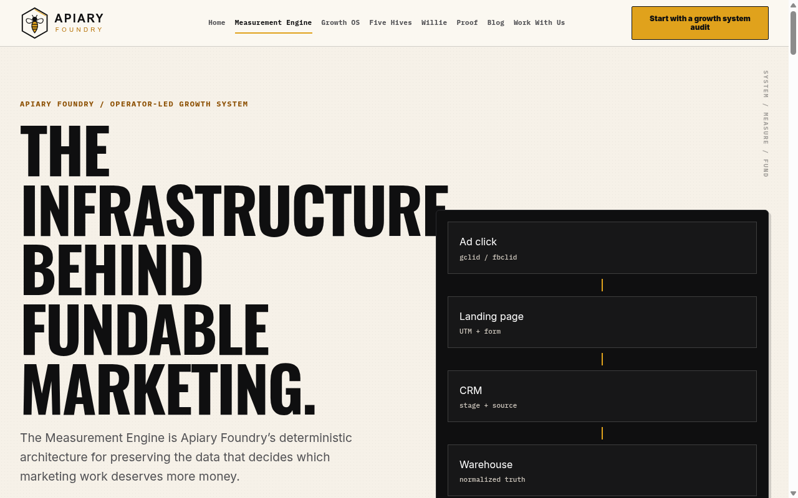

# GitHub issue #38 browser evidence

Issue: https://github.com/peacockesq/apiary-foundry-site/issues/38

## Root cause and fix

The mobile `.hero-grid` used `grid-template-columns: 1fr`. That track retained its automatic minimum, so the heading's min-content width widened the single track beyond the container. The fix uses `minmax(0, 1fr)`, allows hero grid items to shrink with `min-width: 0`, and scales the mobile headline to keep its longest word within the available track. No new global or page-level overflow clipping was added.

## Headed Chromium results

Captured from the locally served candidate with headed Chromium. Mobile captures use Chromium mobile emulation at the exact viewport dimensions. The Mautic tracking script was locally stubbed so the capture performed no external tracking side effect.

| Viewport | `clientWidth` | `scrollWidth` | Overflow | Hero child right edges | HTTP | Console/page errors |
| --- | ---: | ---: | ---: | --- | ---: | --- |
| 375x812 | 375 | 375 | 0 px | 361 px, 361 px | 200 | 0 / 0 |
| 412x915 | 412 | 412 | 0 px | 398 px, 398 px | 200 | 0 / 0 |
| 1280x800 | 1265 | 1265 | 0 px | 622.203 px, 1232.984 px | 200 | 0 / 0 |

Machine-readable measurements: [`results.json`](./results.json)

## Screenshots

### 375x812

### 412x915

### 1280x800 desktop control

## Vision audit

The 375x812 and 412x915 captures show the complete eyebrow, headline, lede copy, and right edge of the CTA without horizontal clipping or smashed navigation chrome. The 1280x800 control preserves the existing two-column hero and measurement path. No cut-off right-edge content or new visual regression was observed.
